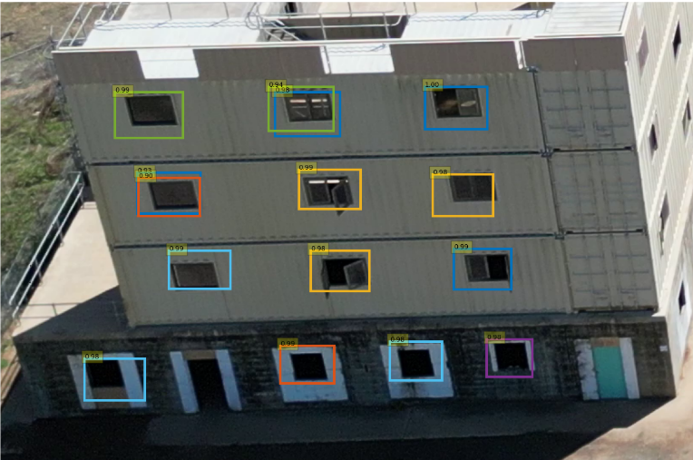
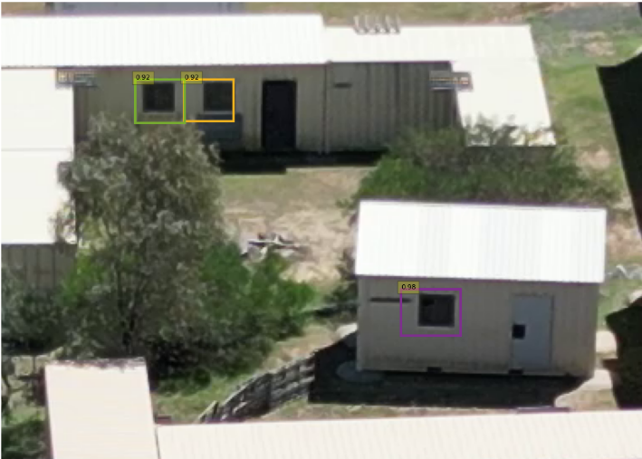
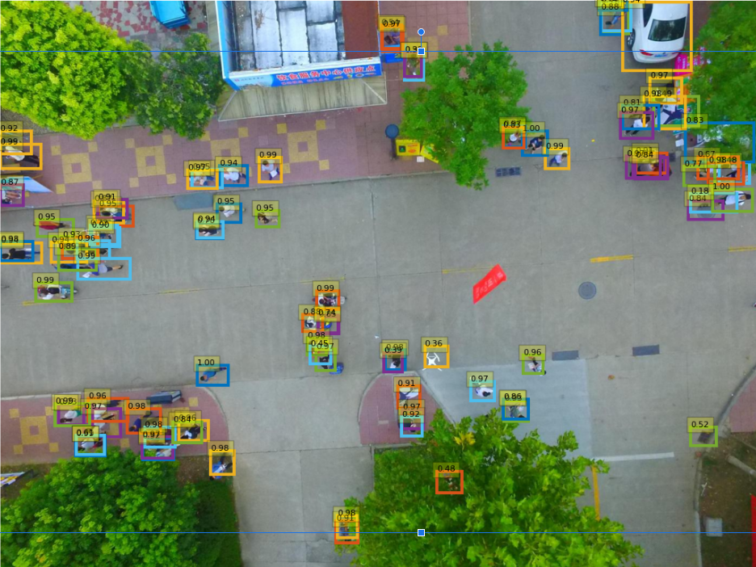
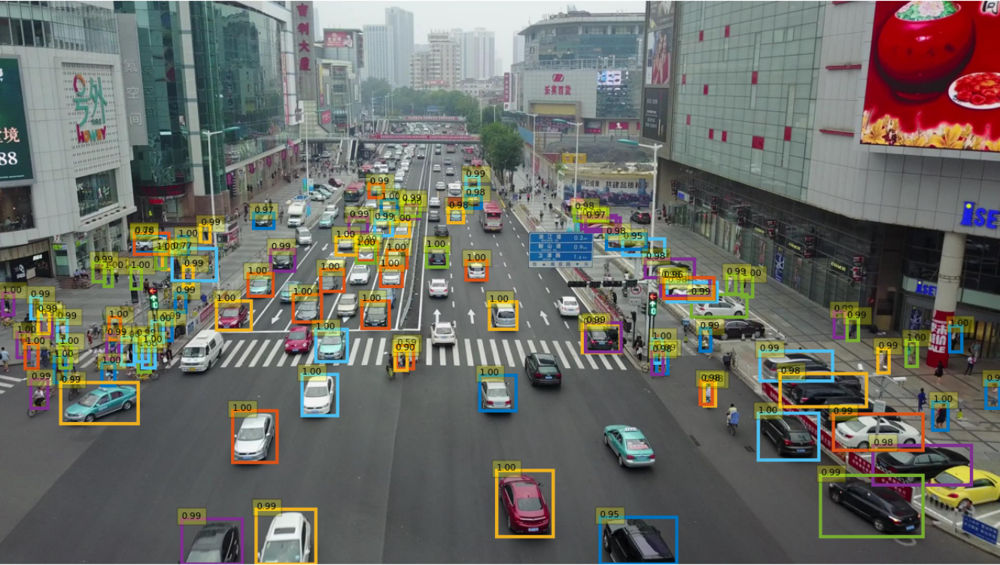

# detr

<p align='center'>
    
    
</p>

<p align='center'>
    
    
</p>

# Introduction

This repository contains functions needed for:  
1- Window detection.  
2- Threat (people cars) detection.  

```detect.cpp``` works with CSV formats. It reads image data from TCP socket 4001 and publishes detections to TCP socket 4003  

```detect_service.py``` works with ROS2 messages. it triggers the camera service on ```trigger_image``` and subscribes to receive image on ```/arena_camera_node/resized/images```. Detections are published on ```/detection_results```, message type ```vision_msgs.msg.Detection2DArray``` https://docs.ros.org/en/lunar/api/vision_msgs/html/msg/Detection2DArray.html.  

## input csv image format
```
format=t,3ui,s[15197952]
```

## output csv detection format
Sent as comma separated for each image:
```
format: d,i,[i,f,f,f,f,f]
```
for N detections:
```
timestamp(d), #detections(i), class_id_1(i), prob_1(f), bbox_1(4f), ..., class_id_N(i), prob_N(f), bbox_N(4f)
```

## Building and running with Docker (for camera service processing)
Using Docker, you can build all executables and nodes.
```
cd docker && ./build
```
Run the Docker container:
```
docker	run  \  
	-it \ 
	--gpus all \
	-e DISPLAY=$DISPLAY \
	-e NVIDIA_DRIVER_CAPABILITIES=graphics,compute,utility,display \
	-v /tmp/.X11-unix:/tmp/.X11-unix \
	missionsystems/detr-devel-amd64 bash
```
Then run:
```
python3 detect_service.py
```

### Model serialisation:
```
cd src
python3 build_model.py
python3 serialise_engine.py
```

## Testing with my_image_service
my_image_service will read images from a directory and publish an image at a time when triggered.
Terminal 1 (compile and run image service):
```
cd my_image_service
docker build -t my_image_service:humble .
docker run -it --rm -v /path/to/your/local/image/directory:/images my_image_service:humble
```
Terminal 2:
```
docker	run  \  
	-it \ 
	--gpus all \
	-e DISPLAY=$DISPLAY \
	-e NVIDIA_DRIVER_CAPABILITIES=graphics,compute,utility,display \
	-v /tmp/.X11-unix:/tmp/.X11-unix \
    -p 4001:4001 \
    -p 4003:4003 \
	missionsystems/detr-devel-amd64
```

## Installation and Usage (for CSV format and ROS publisher/subscriber)

### install OpenCV (deactivate conda)
```
mkdir Thirdparty && cd Thirdparty
git clone --branch 3.4.1 --depth=1 https://github.com/opencv/opencv.git
cd opencv && mkdir build && cd build
cmake \
  -DCMAKE_BUILD_TYPE=Release \
  -DWITH_CUDA=OFF  \
  -DBUILD_DOCS=OFF  \
  -DBUILD_PACKAGE=OFF \
  -DBUILD_TESTS=OFF  \
  -DBUILD_PERF_TESTS=OFF  \
  -DBUILD_opencv_apps=OFF \
  -DBUILD_opencv_calib3d=ON  \
  -DBUILD_opencv_cudaoptflow=OFF  \
  -DBUILD_opencv_dnn=OFF  \
  -DBUILD_opencv_dnn_BUILD_TORCH_IMPORTER=OFF  \
  -DBUILD_opencv_features2d=ON \
  -DBUILD_opencv_flann=ON \
  -DBUILD_opencv_java=ON  \
  -DBUILD_opencv_objdetect=ON  \
  -DBUILD_opencv_python2=OFF  \
  -DBUILD_opencv_python3=OFF  \
  -DBUILD_opencv_photo=ON \
  -DBUILD_opencv_stitching=ON  \
  -DBUILD_opencv_superres=ON  \
  -DBUILD_opencv_shape=ON  \
  -DBUILD_opencv_videostab=OFF \
  -DBUILD_PROTOBUF=OFF \
  -DWITH_1394=OFF  \
  -DWITH_GSTREAMER=OFF  \
  -DWITH_GPHOTO2=OFF  \
  -DWITH_MATLAB=OFF  \
  -DWITH_NVCUVID=OFF \
  -DWITH_OPENCL=OFF \
  -DWITH_OPENCLAMDBLAS=OFF \
  -DWITH_OPENCLAMDFFT=OFF \
  -DWITH_TIFF=OFF  \
  -DWITH_VTK=OFF  \
  -DWITH_WEBP=OFF  \
     ..
make -j3 && sudo make install
```

### install Comma (deactivate conda)
```
 git clone https://github.com/mission-systems-pty-ltd/comma.git
 cd comma && mkdir build && cd build
 cmake ..
 make -j3 && sudo make install
```

### install Snark (deactivate conda)
```
git clone https://github.com/mission-systems-pty-ltd/snark.git
cd snark && mkdir build && cd build
cmake \
  -Dsnark_build_imaging_opencv_contrib=OFF \
  -Dsnark_build_navigation=ON \
  -Dsnark_build_sensors_dc1394=OFF \
  -Dsnark_build_sensors_ouster=ON \
  -Dsnark_build_ros=ON \
    ..
make -j3 && sudo make install
```

### Setup the Conda environment:
```
 conda env create -f environment.yml
```

### get pytorch and torchvision compatible with Orin and cuda 11.4:
```
git clone --recursive -b v1.11.0 https://github.com/pytorch/pytorch
git clone -b v0.15.1 https://github.com/pytorch/vision.git
```
Follow instructions to install pytorch and torchvision.

### Clone this repository
```
cd ~/catkin_ws/src
git clone https://gitlab.com/missionsystems/hyperteaming/detr.git
cd detr && mkdir build && cd build
cmake .. && make
```
### Usage
Run the listener (port 4003 is for 2d detections)
```
nc -l 4003
```
Play the camera data
```
format=t,3ui,s[15197952]
cat cameras/alvium_1800_forward/20230629T043419.333403.bin | csv-play --binary $format --slow 1 | io-publish tcp:4001 --size $( echo $format | csv-format size )

```
Run the threads
```
cd ~/catkin_ws/src/detr/src
conda activate detr
./detect configs/vulcan.yaml
```
To run the rospy node  
start the ROS core in terminal 1
```
roscore
```
Read sample images and publish them in terminal 2
```
cd ~/catkin_ws/src/detr/src
python publish_images.py
```
Run the detector in terminal 3 (requires custom message installed first)
```
cd ~/catkin_ws/src/detr/src
source ~/catkin_ws/devel/setup.bash
python detect_ros.py
```
Inspect detection messages in terminal 4
```
rostopic echo /detection_results
```
The detections message should look like this:
```
---
bounding_boxes: 
  - 
    x_min: 2228.59228515625
    y_min: 1111.793701171875
    x_max: 2256.8974609375
    y_max: 1139.8057861328125
    confidence: 0.8650011420249939
    class_label: "window"
  - 
    x_min: 2633.76806640625
    y_min: 1175.15185546875
    x_max: 2664.6513671875
    y_max: 1205.375
    confidence: 0.8681516051292419
    class_label: "window"
---
```

## Authors and acknowledgment
Tariq and Aspen  
Hyperteaming.

